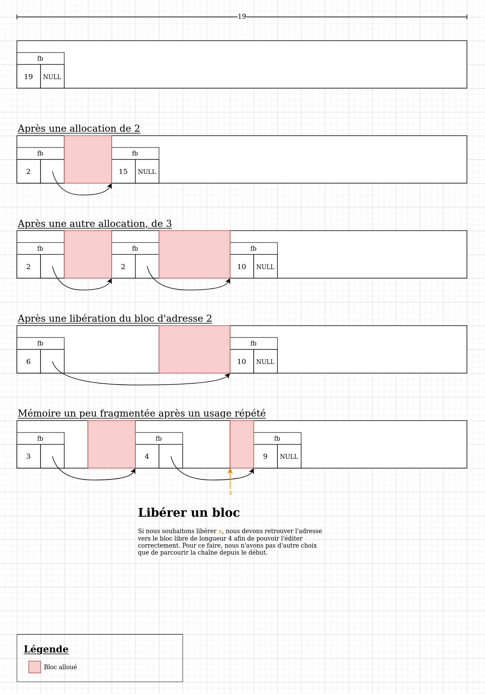

# Projet d'allocateur mémoire en C, API/CPS INFO3, Polytech Grenoble, 2021-2022

DECORSAIRE Mattéo et ONGHENA Edgar

**Ce fichier accompagne, mais ne se substitue pas au compte rendu en PDF.**

## Compilation

Il faut installer les en-têtes valgrind (`apt install valgrind` sur Ubuntu/Mint/Debian)

```bash
make
```

## Exécution des tests

```bash
make tests
```

## Exécution des tests Rust

Le [compilateur Rust et cargo](https://rustup.rs/) doivent être installés.

```bash
cd rust
cargo test
```

## Documentation HTML de la bibliothèque Rust

```bash
cd rust
cargo doc --open
```

## Description de la structure de l'allocateur



`fb`
~ Une structure située a chaque début de zone libre
Contient 2 champs:
* `.size`: la taille du bloc libre, y compris la structure `fb` (on considère qu'elle fait partie de la zone libre)
* `.next`: pointeur vers la zone libre suivante, ou NULL s'il n'y en a pas (dernière zone du tas)
Les zones libres démarrant toutes par un `fb`, ce pointeur peut aussi être vu comme pointant vers un `fb`. On considèrera même qu'un `fb` et une zone libre sont quasiment la même entité.

`allocator_header` (alignée sur 16 octets)
~ Structure unique et globale dans le programme qui décrit les paramètres de l'allocateur. Elle se situera au début de notre tas.
3 champs:
* `.memory_size`: La longueur total du tas, sans y ôter la taille de la structure `allocator_header`
* `.fit`: La fonction utilisée à l'instant courant pour trouver une nouvelle zone à allouer. Cela permet d'utiliser plusieurs algorithmes différents et d'en changer à l'exécution.
* `.guards_enabled`: Le système de gardes est-il activé ? Si oui, des gardes dont la taille correspond à `__BIGGEST_ALIGNMENT__` sont ajoutés à gauche et à droite de chaque zone allouée. Cela a un impact conséquent sur la taille des allocations, qui font donc 32 octets de plus sur une cible 64 bits.

### Initialisation

Au commencement, tout le tas (d'adresse `memory_addr`) est consititué
* d'une structure `allocator_header` au tout début
* puis d'une zone libre de taille `memory_addr->memory_size - sizeof(allocator_header)`

Comme pour chaque zone libre, il y a un `fb` au début de la première zone libre, dont la longueur est `memory_addr->memory_size - sizeof(allocator_header)` et le pointeur `next` est nul puisqu'il n'y a qu'une seule grande zone libre (pas de suivante).

### Allocation

Lors d'une tentative d'allocation, on parcoure les `fb` chaînées jusqu'à en trouver une dont `.size - 2 * sizeof(fb) >= <taille demandée>`. Pourquoi "2x" ? Parce que `size` désigne l'espace libre, mais qu'il faut y retirer:
* la taille du `fb` résident au début de la zone libre actuelle, qui doit rester
* la taille du nouveau `fb` qui devra être créé juste _après_ la nouvelle zone allouée

Si cette condition est validée pour une zone libre (la première; algorithme first fit):
On appelle `ZL` la zone libre, `t` la taille à allouer;
* La nouvelle zone allouée aura pour adresse `ZL + sizeof(fb)`, c'est à dire qu'elle "touche" l'en-tête de l'ex-zone libre
* La mémoire étant soit allouée, soit libre, l'espace qui suit la nouvelle zone allouée DOIT être libre, et contient donc une nouvelle structure `fb` qui en indique la longueur. Cette zone libre commence donc à `ZL + sizeof(fb) + t`. L'en-tête a `.size = ZL->size - t - sizeof(fb)` et `next = ZL->next`
* `*ZL` doit être mis à jour pour tenir compte du nouvel en-tête qui vient d'être inséré. `.next = ZL + sizeof(fb) + t` (l'adresse ci-dessus) et `.size = sizeof(fb)` puisque nous faisons le choix de coller la nouvelle zone occupée à la suite de `ZL`.

Lorsque les gardes sont activés, la zone allouée effectivement est plus grande de `2*sizeof(guard)` octets. La zone renvoyée à l'utilisateur est "prise en sandwich" entre deux gardes qui sont par ailleurs initialisés à une valeur constante.

### Libération

Remarque: un `fb` représente une zone libre. Mais il contient également suffisamment d'informations pour retrouver l'intervalle d'adresse de la zone allouée la suivant (sauf pour le tout dernier `fb` qui n'est pas suivie par une zone allouée).

Pour libérer une zone mémoire d'adresse `x`, nous devons retrouver le `fb` qui se trouve juste avant celle-ci (il y en a forcément un). Notre choix de représentation interne nous oblige à reparcourir toute la liste chaînée jusqu'à ce qu'un `(fb + fb->size) == x` (complexité qui nous a été indiquée comme tolérable).

On aurait également pu allouer des zones un peu plus grandes de `sizeof(void*)` octets à chaque fois, et stocker un pointeur vers le `fb` précédent chaque zone allouée `y` juste avant le pointeur donné à l'utilisateur tel que `fb_prec(y) = y - sizeof(fb*)`, pour y accéder en temps $\mathcal O(n)$, mais nous n'utiliserons pas cette solution pour nous épargner de la complexité de mise en oeuvre.

Une fois le `fb` trouvé, le but est de fusionner sa zone libre avec celle qui la suit, tout en "supprimant" le `fb` suivant (on se contentera de modifier la structure de la liste chaînée pour l'oublier).

Soit `Zb` l'adresse du `fb` précédent la zone occupée à libérer:
* _On admet pour le moment que le free est toujours effectué sur un pointeur correspondant bel et bien à une allocation. On peut en déduire que `Zb->next` n'est jamais nul._
* `Zb->size := (Zb->next - Zb) + Zb->next->size`
* `Zb->next := Zb->next->next`
* La fusion est terminée.

### Détection d'erreur

* Lors de n'importe quel parcours, on peut vérifier pour chaque zone libre `Z` que le pointeur `Z.next` ne pointe pas à une adresse inférieure à `Z + Z.size`. Si cela se produisait, on aurait la certitude que l'allocateur est corrompu, que la faute soit la nôtre ou celle de l'utilisateur.

* Lors d'une libération d'un pointeur `x`, on pourra éventuellement détecter -- lors du parcours de la liste -- si on dépasse `x`, ce qui signifie que l'utilisateur essaye de libérer un pointeur qui n'est pas alloué, qu'il l'ai été par le passé ou non. On peut dans ce cas planter, ou tolérer l'erreur et afficher un avertissement.

* On peut utiliser le système de gardes. Des valeurs constantes sont écrites avant et après la zone renvoyée à l'utilisateur lors d'une allocation. Lors d'un `free`, on s'assure que ces constantes sont restées inchangées.
